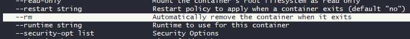

# Module 1 Homework

------------------------------------------------

## Question 1. Knowing docker tags

*Which tag has the following text? - Automatically remove the container when it exits*

* --delete
* --rc
* --rmc
* --rm

**ANSWER: --rm**




------------------------------------------------

## Question 2. Understanding docker first run

*Run docker with the python:3.9 image in an interactive mode and the entrypoint of bash. Now check the python modules that are installed ( use pip list ).
What is version of the package wheel ?*

* 0.42.0
* 1.0.0
* 23.0.1
* 58.1.0

**ANSWER: 0.42.0**

```
(base) lottie@de-zoomcamp:~/data-engineering-zoomcamp/homework/module-1-homework$ docker  run -it --entrypoint /bin/bash python:3.9
root@641436a41530:/# pip show wheel
Name: wheel
Version: 0.42.0
Summary: A built-package format for Python
Home-page:
Author:
Author-email: Daniel Holth dholth@fastmail.fm
License:
Location: /usr/local/lib/python3.9/site-packages
Requires:
Required-by:
```

------------------------------------------------

## Prepare Postgres

*Run Postgres and load data as shown in the videos We'll use the green taxi trips from September 2019:*

`SEE FOLDER 'ingest-green-taxi-data'`

### Question 3. Count records

How many taxi trips were totally made on September 18th 2019?
Tip: started and finished on 2019-09-18.
Remember that lpep_pickup_datetime and lpep_dropoff_datetime columns are in the format timestamp (date and hour+min+sec) and not in date.

* 15767
* 15612
* 15859
* 89009

**ANSWER: 15612**

```
SELECT COUNT(*) AS total_trips
FROM green_taxi
WHERE 
    DATE(lpep_pickup_datetime) = '2019-09-18'
    AND DATE(lpep_dropoff_datetime) = '2019-09-18';

```

-----------------------

### Question 4. Largest trip for each day

Which was the pick up day with the largest trip distance Use the pick up time for your calculations.

* 2019-09-18
* 2019-09-16
* 2019-09-26
* 2019-09-21

**ANSWER: 2019-09-26**

```
SELECT 
    DATE(lpep_pickup_datetime) AS pickup_day,
    MAX(trip_distance) AS max_trip_distance
FROM green_taxi_data
GROUP BY pickup_day
ORDER BY max_trip_distance DESC;
```

---------------------------

### Question 5. Three biggest pick up Boroughs

Consider lpep_pickup_datetime in '2019-09-18' and ignoring Borough has Unknown
Which were the 3 pick up Boroughs that had a sum of total_amount superior to 50000?

* "Brooklyn" "Manhattan" "Queens"
* "Bronx" "Brooklyn" "Manhattan"
* "Bronx" "Manhattan" "Queens"
* "Brooklyn" "Queens" "Staten Island"

**ANSWER: "Brooklyn" "Manhattan" "Queens"**

```
SELECT 
    z."Borough" AS pickup_borough,
    SUM(g."total_amount") AS total_amount_sum
FROM "green_taxi_data" g
JOIN "zones" z ON g."PULocationID" = z."LocationID"
WHERE 
    DATE(g."lpep_pickup_datetime") = '2019-09-18'
    AND z."Borough" <> 'Unknown'
GROUP BY z."Borough"
HAVING SUM(g."total_amount") > 50000
ORDER BY total_amount_sum DESC
LIMIT 3;
```

-------------------------

### Question 6. Largest tip

For the passengers picked up in September 2019 in the zone name Astoria which was the drop off zone that had the largest tip? We want the name of the zone, not the id.
Note: it's not a typo, it's tip , not trip

* Central Park
* Jamaica
* JFK Airport
* Long Island City/Queens Plaza

**ANSWER: JFK Airport**

```
SELECT 
    z_dropoff."Zone" AS dropoff_zone,
    MAX(g."tip_amount") AS max_tip_amount
FROM "green_taxi_data" g
JOIN "zones" z_pickup ON g."PULocationID" = z_pickup."LocationID"
JOIN "zones" z_dropoff ON g."DOLocationID" = z_dropoff."LocationID"
WHERE 
    DATE(g."lpep_pickup_datetime") >= '2019-09-01'
    AND DATE(g."lpep_pickup_datetime") < '2019-10-01'
    AND z_pickup."Zone" = 'Astoria'
GROUP BY z_dropoff."Zone"
ORDER BY max_tip_amount DESC
LIMIT 1;
```

-----------------------

## Terraform

In this section homework we'll prepare the environment by creating resources in GCP with Terraform.

In your VM on GCP/Laptop/GitHub Codespace install Terraform. Copy the files from the course repo here to your VM/Laptop/GitHub Codespace.

Modify the files as necessary to create a GCP Bucket and Big Query Dataset.

 `SEE FOLDER 'terraform-files'` 

--------------------

### Question 7. Creating Resources

After updating the main.tf and variable.tf files run:
`terraform apply` Paste the output of this command into the homework submission form.

```
(base) lottie@de-zoomcamp:~/data-engineering-zoomcamp/01-docker-terraform/1_terraform_gcp/terraform/terraform_with_variables$ terraform apply

Terraform used the selected providers to generate the following execution plan. Resource actions are indicated with the following symbols:
  + create

Terraform will perform the following actions:

  # google_bigquery_dataset.ny_taxi_rides_data_967682f4482f will be created
  + resource "google_bigquery_dataset" "ny_taxi_rides_data_967682f4482f" {
      + creation_time              = (known after apply)
      + dataset_id                 = "ny_taxi_rides_data_967682f4482f"
      + default_collation          = (known after apply)
      + delete_contents_on_destroy = true
      + effective_labels           = (known after apply)
      + etag                       = (known after apply)
      + id                         = (known after apply)
      + is_case_insensitive        = (known after apply)
      + last_modified_time         = (known after apply)
      + location                   = "EU"
      + max_time_travel_hours      = (known after apply)
      + project                    = "ny-taxi-rides-data"
      + self_link                  = (known after apply)
      + storage_billing_model      = (known after apply)
      + terraform_labels           = (known after apply)
    }

  # google_storage_bucket.ny-taxi-rides-data-967682f4482f will be created
  + resource "google_storage_bucket" "ny-taxi-rides-data-967682f4482f" {
      + effective_labels            = (known after apply)
      + force_destroy               = true
      + id                          = (known after apply)
      + location                    = "EU"
      + name                        = "ny-taxi-rides-data-967682f4482f"
      + project                     = (known after apply)
      + public_access_prevention    = (known after apply)
      + self_link                   = (known after apply)
      + storage_class               = "STANDARD"
      + terraform_labels            = (known after apply)
      + uniform_bucket_level_access = (known after apply)
      + url                         = (known after apply)

      + lifecycle_rule {
          + action {
              + type = "AbortIncompleteMultipartUpload"
            }
          + condition {
              + age                   = 30
              + matches_prefix        = []
              + matches_storage_class = []
              + matches_suffix        = []
              + with_state            = (known after apply)
            }
        }
    }

Plan: 2 to add, 0 to change, 0 to destroy.

Do you want to perform these actions?
  Terraform will perform the actions described above.
  Only 'yes' will be accepted to approve.

  Enter a value: yes

google_bigquery_dataset.ny_taxi_rides_data_967682f4482f: Creating...
google_storage_bucket.ny-taxi-rides-data-967682f4482f: Creating...
google_bigquery_dataset.ny_taxi_rides_data_967682f4482f: Creation complete after 2s [id=projects/ny-taxi-rides-data/datasets/ny_taxi_rides_data_967682f4482f]
google_storage_bucket.ny-taxi-rides-data-967682f4482f: Creation complete after 2s [id=ny-taxi-rides-data-967682f4482f]

Apply complete! Resources: 2 added, 0 changed, 0 destroyed.
(base) lottie@de-zoomcamp:~/data-engineering-zoomcamp/01-docker-terraform/1_terraform_gcp/terraform/terraform_with_variables$ terraform destroy
google_bigquery_dataset.ny_taxi_rides_data_967682f4482f: Refreshing state... [id=projects/ny-taxi-rides-data/datasets/ny_taxi_rides_data_967682f4482f]
google_storage_bucket.ny-taxi-rides-data-967682f4482f: Refreshing state... [id=ny-taxi-rides-data-967682f4482f]

Terraform used the selected providers to generate the following execution plan. Resource actions are indicated with the following symbols:
  - destroy

Terraform will perform the following actions:

  # google_bigquery_dataset.ny_taxi_rides_data_967682f4482f will be destroyed
  - resource "google_bigquery_dataset" "ny_taxi_rides_data_967682f4482f" {
      - creation_time                   = 1706290697784 -> null
      - dataset_id                      = "ny_taxi_rides_data_967682f4482f" -> null
      - default_partition_expiration_ms = 0 -> null
      - default_table_expiration_ms     = 0 -> null
      - delete_contents_on_destroy      = true -> null
      - effective_labels                = {} -> null
      - etag                            = "F0l8/Fk531NCMJt2neS89Q==" -> null
      - id                              = "projects/ny-taxi-rides-data/datasets/ny_taxi_rides_data_967682f4482f" -> null
      - is_case_insensitive             = false -> null
      - labels                          = {} -> null
      - last_modified_time              = 1706290697784 -> null
      - location                        = "EU" -> null
      - project                         = "ny-taxi-rides-data" -> null
      - self_link                       = https://bigquery.googleapis.com/bigquery/v2/projects/ny-taxi-rides-data/datasets/ny_taxi_rides_data_967682f4482f -> null
      - terraform_labels                = {} -> null

      - access {
          - role          = "OWNER" -> null
          - user_by_email = 539313211848-compute@developer.gserviceaccount.com -> null
        }
      - access {
          - role          = "OWNER" -> null
          - special_group = "projectOwners" -> null
        }
      - access {
          - role          = "READER" -> null
          - special_group = "projectReaders" -> null
        }
      - access {
          - role          = "WRITER" -> null
          - special_group = "projectWriters" -> null
        }
    }

  # google_storage_bucket.ny-taxi-rides-data-967682f4482f will be destroyed
  - resource "google_storage_bucket" "ny-taxi-rides-data-967682f4482f" {
      - default_event_based_hold    = false -> null
      - effective_labels            = {} -> null
      - enable_object_retention     = false -> null
      - force_destroy               = true -> null
      - id                          = "ny-taxi-rides-data-967682f4482f" -> null
      - labels                      = {} -> null
      - location                    = "EU" -> null
      - name                        = "ny-taxi-rides-data-967682f4482f" -> null
      - project                     = "ny-taxi-rides-data" -> null
      - public_access_prevention    = "inherited" -> null
      - requester_pays              = false -> null
      - self_link                   = https://www.googleapis.com/storage/v1/b/ny-taxi-rides-data-967682f4482f -> null
      - storage_class               = "STANDARD" -> null
      - terraform_labels            = {} -> null
      - uniform_bucket_level_access = false -> null
      - url                         = "gs://ny-taxi-rides-data-967682f4482f" -> null

      - lifecycle_rule {
          - action {
              - type = "AbortIncompleteMultipartUpload" -> null
            }
          - condition {
              - age                        = 30 -> null
              - days_since_custom_time     = 0 -> null
              - days_since_noncurrent_time = 0 -> null
              - matches_prefix             = [] -> null
              - matches_storage_class      = [] -> null
              - matches_suffix             = [] -> null
              - num_newer_versions         = 0 -> null
              - with_state                 = "ANY" -> null
            }
        }
    }

Plan: 0 to add, 0 to change, 2 to destroy.

Do you really want to destroy all resources?
  Terraform will destroy all your managed infrastructure, as shown above.
  There is no undo. Only 'yes' will be accepted to confirm.

  Enter a value: yes

google_storage_bucket.ny-taxi-rides-data-967682f4482f: Destroying... [id=ny-taxi-rides-data-967682f4482f]
google_bigquery_dataset.ny_taxi_rides_data_967682f4482f: Destroying... [id=projects/ny-taxi-rides-data/datasets/ny_taxi_rides_data_967682f4482f]
google_storage_bucket.ny-taxi-rides-data-967682f4482f: Destruction complete after 1s
google_bigquery_dataset.ny_taxi_rides_data_967682f4482f: Destruction complete after 1s

Destroy complete! Resources: 2 destroyed.
```

------------------------

Submitting the solutions

* Form for submitting: https://courses.datatalks.club/de-zoomcamp-2024/homework/hw01
* You can submit your homework multiple times. In this case, only the last submission will be used.

Deadline: 29 January, 23:00 CET

