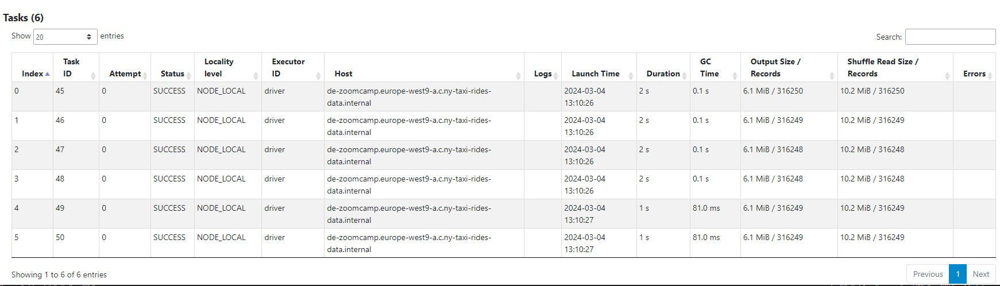

## Week 5 Homework 

### Question 1: 

**Install Spark and PySpark** 

- Install Spark
- Run PySpark
- Create a local spark session
- Execute spark.version.

What's the output?

**ANSWER: '3.4.2'**

```bash
(base) lottie@de-zoomcamp:~$ pyspark
Python 3.11.5 (main, Sep 11 2023, 13:54:46) [GCC 11.2.0] on linux
Type "help", "copyright", "credits" or "license" for more information.
Setting default log level to "WARN".
To adjust logging level use sc.setLogLevel(newLevel). For SparkR, use setLogLevel(newLevel).
24/02/29 22:22:48 WARN NativeCodeLoader: Unable to load native-hadoop library for your platform... using builtin-java classes where applicable
Welcome to
      ____              __
     / __/__  ___ _____/ /__
    _\ \/ _ \/ _ `/ __/  '_/
   /__ / .__/\_,_/_/ /_/\_\   version 3.4.2
      /_/

Using Python version 3.11.5 (main, Sep 11 2023 13:54:46)
Spark context Web UI available at http://de-zoomcamp.europe-west9-a.c.ny-taxi-rides-data.internal:4040
Spark context available as 'sc' (master = local[*], app id = local-1709245369742).
SparkSession available as 'spark'.
>>> spark.version
'3.4.2'
>>>
```
--------------------------

### Question 2: 

**FHV October 2019**

Read the October 2019 FHV into a Spark Dataframe with a schema as we did in the lessons.

Repartition the Dataframe to 6 partitions and save it to parquet.

What is the average size of the Parquet (ending with .parquet extension) Files that were created (in MB)? Select the answer which most closely matches.

- 1MB
- __*6MB*__
- 25MB
- 87MB

**ANSWER: 6MB**

**See `module-5-homework.ipynb` for code**



-----------------------------

### Question 3: 

**Count records** 

How many taxi trips were there on the 15th of October?

Consider only trips that started on the 15th of October.

- 108,164
- 12,856
- 452,470
- __*62,610*__

**ANSWER: 62,610**

**See `module-5-homework.ipynb` for code**

-----------------------

### Question 4: 

**Longest trip for each day** 

What is the length of the longest trip in the dataset in hours?

- __*631,152.50 Hours*__
- 243.44 Hours
- 7.68 Hours
- 3.32 Hours

**ANSWER: 631,152.50 Hours**

**See `module-5-homework.ipynb` for code**

-----------------------------

### Question 5: 

**User Interface**

Spark’s User Interface which shows the application's dashboard runs on which local port?

- 80
- 443
- __*4040*__
- 8080

**ANSWER: 4040**

---------------------------

### Question 6: 

**Least frequent pickup location zone**

Using the zone lookup data and the FHV October 2019 data, what is the name of the LEAST frequent pickup location Zone?

- East Chelsea
- __*Jamaica Bay*__
- Union Sq
- Crown Heights North

**ANSWER: Jamaica Bay**

**See `module-5-homework.ipynb` for code**

--------------------------